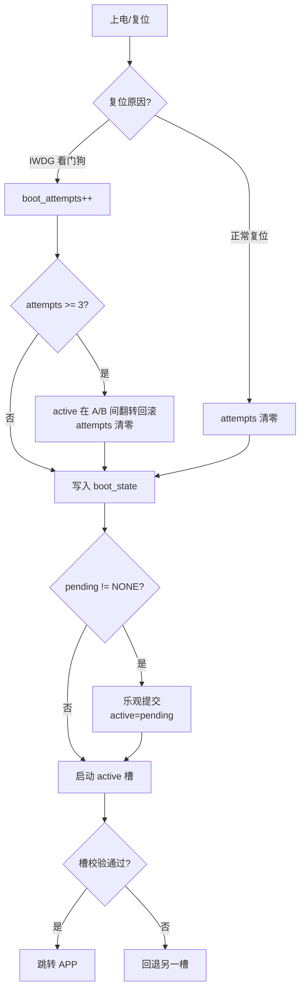
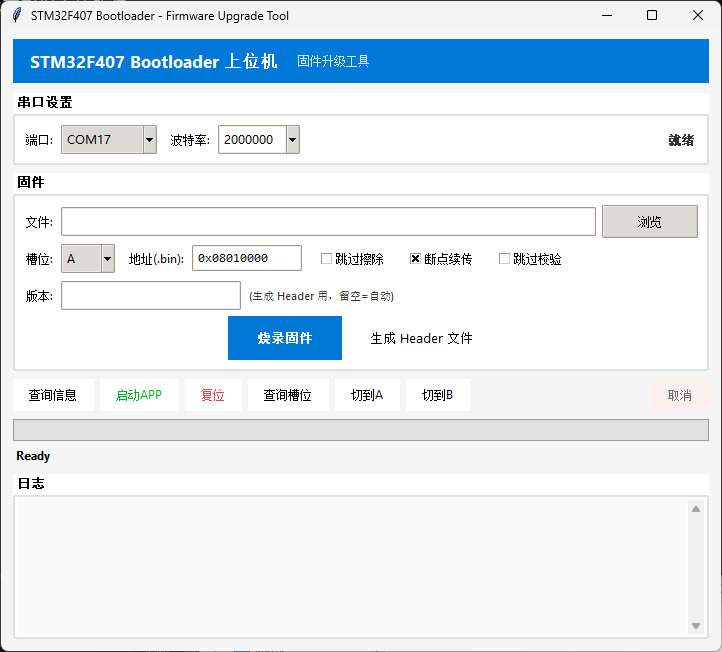

# BOOT2026 — STM32F407 A/B 双备份 Bootloader

基于 STM32F407（Cortex-M4）的 **A/B 双备份固件升级 Bootloader**，使用 STM32Cube LL 库 + GCC/Makefile 构建，
配合上位机 Python 工具实现串口一键烧录、断点续传、固件去重，以及**看门狗自动回滚**的高可靠 OTA 升级方案。

## 特性

-  **A/B 双槽位**：A 槽 448KB、B 槽 508KB，升级失败自动回滚
-  **看门狗自动回滚**：新固件连续 3 次崩溃（IWDG 复位）自动翻回旧槽
-  **三重校验**：Magic Header CRC32 + 固件 CRC32 + 写后回读校验
-  **Flash 写保护**：`flash_range_check` 硬校验，防止 `uint32` 溢出绕过 Bootloader 写保护
-  **流水线烧录**：DMA 接收 + 分块流水线编程，2Mbps 波特率高速烧录
-  **断点续传**：烧录中断后从 `.resume.json` 检查点继续
-  **固件去重**：烧录前探测目标槽 CRC，一致则跳过擦写（`--force` 强制重烧）
-  **上位机工具**：Python CLI + GUI 图形界面

## Flash 分区表

| 区域 | 起始地址 | 大小 | 说明 |
|------|----------|------|------|
| Bootloader | `0x08000000` | 32KB（Sector 0~1） | 本工程 |
| Boot State | `0x08008000` | 16KB（Sector 2） | A/B 状态持久化 |
| A 槽 Header | `0x0800C000` | 16KB（Sector 3） | A 槽 Magic Header |
| A 槽 APP | `0x08010000` | 448KB（Sector 4~7） | A 槽应用 |
| B 槽 Header | `0x08080000` | 4KB（Sector 8 起始） | B 槽 Magic Header |
| B 槽 APP | `0x08081000` | 508KB（Sector 8 尾~11） | B 槽应用 |

## 目录结构

```
BOOT2026/
├── app/                  # 应用层：bootloader、boot_state、magic_header 等
├── components/           # 组件：CRC16/CRC32、EasyLogger、RingBuffer
├── driver/               # 驱动：串口(DMA)、Flash 编程、按键、LED、延时
├── platform/             # 平台：CMSIS、LL 库、启动文件、链接脚本
├── tools/                # 工具链（arm-none-eabi-gcc）与同步脚本
├── 上位机源码/            # Python 上位机：CLI + GUI + 协议层
├── Makefile              # 构建脚本
└── docs/images/          # 效果图
```

## A/B 升级与回滚机制

`boot_state` 结构持久化在 Flash 的 Boot State 区，字段语义：

| 字段 | 含义 |
|------|------|
| `active_slot` | 当前已提交的启动槽（默认启动） |
| `pending_slot` | 待激活槽（OTA 目标），`0xFF` 表示无 |
| `boot_attempts` | 当前槽连续看门狗复位次数 |

启动决策链（`bootloader_main`）：

1. 读取 `boot_state`（无效则回退默认：active=A）
2. 看门狗复位（`IWDGRST`）→ `boot_attempts++`；连续 ≥3 次判定当前槽为坏，active 在 A/B 间翻转回滚
3. 非看门狗复位（上电/软复位/外部复位）→ 清零 `boot_attempts`
4. 若 `pending != NONE`，乐观提交：`active = pending`，`pending = NONE`
5. 启动槽 = pending 优先，否则 active；失败则回退另一槽



> **看门狗约定**：IWDG 一旦使能无法关闭。Bootloader 跳转前 reload 一次，应用须在 3.2s 超时前接管喂狗，
> 否则被判定崩溃并累计 `boot_attempts`。（超时取 3.2s：覆盖 F407 128KB 扇区擦除 max 2.6s，擦除期间喂狗中断停摆）

## 通信协议

帧格式（上位机 → Bootloader，请求头 `0xAA`；Bootloader → 上位机，响应头 `0x55`）：

```
请求: 0xAA | opcode(1) | length(2,大端) | payload(length) | CRC16(2)
响应: 0x55 | opcode(1) | errcode(1)     | length(2,大端)   | payload(length) | CRC16(2)
```

CRC16 采用 XMODEM（poly=0x1021，init=0x0000，不反转）；CRC32 采用 IEEE 802.3（同 `zlib.crc32`）。

| Opcode | 值 | 说明 |
|--------|----|------|
| `INQUERY` | `0x01` | 查询版本/MTU/槽位状态 |
| `ERASE` | `0x81` | 擦除 Flash 扇区 |
| `PROGRAM` | `0x82` | 编程 Flash（4 字节对齐） |
| `VERIFY` | `0x33` | CRC32 校验 |
| `BOOT` | `0x22` | 跳转 APP |
| `RESET` | `0x23` | 系统复位 |
| `SWITCH_SLOT` | `0x24` | 切换启动槽（写 pending） |

## 构建

工具链：`tools/gcc-arm-none-eabi/10.3`（`arm-none-eabi-gcc`）。

```bash
make            # 编译生成 build/Boot.bin / Boot.hex
make clean      # 清理
```

烧录 Bootloader 本体可用 ST-Link / J-Link / 串口 ISP，将其写入 `0x08000000`。

## 上位机工具

上位机源码位于 `上位机源码/`（依赖 `pyserial`）：

```bash
pip install -r requirements.txt

# CLI
python stm32bl.py --list                          # 列出串口
python stm32bl.py COM3 flash firmware.bin --slot A   # 烧录到 A 槽（自动生成 Header）
python stm32bl.py COM3 flash firmware.xbin           # 烧录 .xbin（含 Header）
python stm32bl.py COM3 status                        # 查询 A/B 槽状态
python stm32bl.py COM3 switch --slot B               # 切换启动槽
python stm32bl.py COM3 boot                          # 跳转 APP
python stm32bl.py COM3 reset                         # 系统复位

# 常用参数
--baud 2000000       # 波特率（默认 2M）
--resume             # 断点续传
--force              # 关闭去重，强制重烧
--no-switch          # 烧录后不切换槽/不复位
```

> 烧录流程：`ERASE → PROGRAM(Header + 固件, 分块流水线) → VERIFY → SWITCH_SLOT → RESET`，
> 默认开启去重（探测目标槽 CRC 一致则跳过擦写）。

## 效果图




